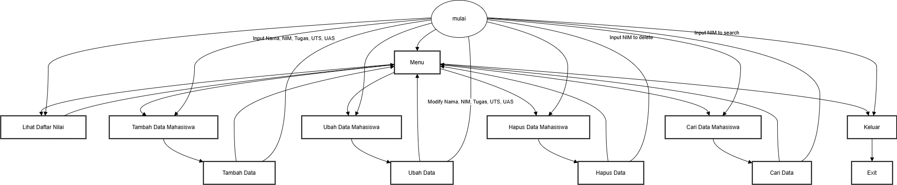

#input dan output dari pratiku 5
## Input
```Python
def tampilkan_nilai(mahasiswa):
    if not mahasiswa:
        print("\nTidak ada data mahasiswa yang dimasukkan.")
        return
    
    print("\nDaftar Nilai Mahasiswa:")
    print("="*80)
    print(f"{'No':<5} {'NIM':<20} {'NAMA':<25} {'TUGAS':<10} {'UTS':<10} {'UAS':<10} {'AKHIR':<10}")
    print("="*80)
    
    mahasiswa.sort(key=lambda x: x['AKHIR'], reverse=True)  # Sort by AKHIR grade in descending order

    for i, data in enumerate(mahasiswa, 1):
        print(f"{i:<5} {data['NIM']:<20} {data['NAMA']:<25} {data['TUGAS']:<10} {data['UTS']:<10} {data['UAS']:<10} {data['AKHIR']:<10}")

def input_data_mahasiswa():
    mahasiswa = []
    while True:
        print("\nMasukkan data mahasiswa:")
        nama = input("Nama Mahasiswa: ")
        if nama.lower() == 'selesai':
            break
        nim = input("NIM: ")
        
        # Input with validation
        try:
            tugas = float(input("Nilai Tugas: "))
            if not (0 <= tugas <= 100):
                print("Nilai tugas harus antara 0 dan 100!")
                continue
        except ValueError:
            print("Input nilai tugas tidak valid!")
            continue
        
        try:
            uts = float(input("Nilai UTS: "))
            if not (0 <= uts <= 100):
                print("Nilai UTS harus antara 0 dan 100!")
                continue
        except ValueError:
            print("Input nilai UTS tidak valid!")
            continue
        
        try:
            uas = float(input("Nilai UAS: "))
            if not (0 <= uas <= 100):
                print("Nilai UAS harus antara 0 dan 100!")
                continue
        except ValueError:
            print("Input nilai UAS tidak valid!")
            continue
        
        akhir = (tugas * 0.3) + (uts * 0.3) + (uas * 0.4)
        
        mahasiswa.append({
            "NIM": nim,
            "NAMA": nama,
            "TUGAS": tugas,
            "UTS": uts,
            "UAS": uas,
            "AKHIR": round(akhir, 2)
        })
    
    return mahasiswa

def tambah_data(mahasiswa):
    print("\nMasukkan data mahasiswa baru:")
    nama = input("Nama Mahasiswa: ")
    nim = input("NIM: ")
    
    # Input with validation
    try:
        tugas = float(input("Nilai Tugas: "))
        if not (0 <= tugas <= 100):
            print("Nilai tugas harus antara 0 dan 100!")
            return mahasiswa
    except ValueError:
        print("Input nilai tugas tidak valid!")
        return mahasiswa
    
    try:
        uts = float(input("Nilai UTS: "))
        if not (0 <= uts <= 100):
            print("Nilai UTS harus antara 0 dan 100!")
            return mahasiswa
    except ValueError:
        print("Input nilai UTS tidak valid!")
        return mahasiswa
    
    try:
        uas = float(input("Nilai UAS: "))
        if not (0 <= uas <= 100):
            print("Nilai UAS harus antara 0 dan 100!")
            return mahasiswa
    except ValueError:
        print("Input nilai UAS tidak valid!")
        return mahasiswa
    
    akhir = (tugas * 0.3) + (uts * 0.3) + (uas * 0.4)
    
    mahasiswa.append({
        "NIM": nim,
        "NAMA": nama,
        "TUGAS": tugas,
        "UTS": uts,
        "UAS": uas,
        "AKHIR": round(akhir, 2)
    })
    return mahasiswa

def ubah_data(mahasiswa):
    nim = input("\nMasukkan NIM mahasiswa yang ingin diubah: ")
    for data in mahasiswa:
        if data['NIM'] == nim:
            print(f"\nData ditemukan untuk {data['NAMA']} (NIM: {nim}).")
            try:
                data['TUGAS'] = float(input("Nilai Tugas baru: "))
                data['UTS'] = float(input("Nilai UTS baru: "))
                data['UAS'] = float(input("Nilai UAS baru: "))
                # Recalculate final grade
                data['AKHIR'] = round((data['TUGAS'] * 0.3) + (data['UTS'] * 0.3) + (data['UAS'] * 0.4), 2)
                print("Data berhasil diubah.")
            except ValueError:
                print("Input nilai tidak valid.")
            return mahasiswa
    print("NIM tidak ditemukan!")
    return mahasiswa

def hapus_data(mahasiswa):
    nim = input("\nMasukkan NIM mahasiswa yang ingin dihapus: ")
    for data in mahasiswa:
        if data['NIM'] == nim:
            mahasiswa.remove(data)
            print(f"\nData mahasiswa dengan NIM {nim} telah dihapus.")
            return mahasiswa
    print("NIM tidak ditemukan!")
    return mahasiswa

def cari_data(mahasiswa):
    nim = input("\nMasukkan NIM mahasiswa yang ingin dicari: ")
    for data in mahasiswa:
        if data['NIM'] == nim:
            print("\nData mahasiswa ditemukan:")
            print(f"NIM: {data['NIM']}\nNama: {data['NAMA']}\nTugas: {data['TUGAS']}\nUTS: {data['UTS']}\nUAS: {data['UAS']}\nAkhir: {data['AKHIR']}")
            return
    print("NIM tidak ditemukan!")

def main():
    mahasiswa = []
    
    while True:
        print("\nMenu:")
        print("(L)ihat Daftar Nilai")
        print("(T)ambah Data Mahasiswa")
        print("(U)bah Data Mahasiswa")
        print("(H)apus Data Mahasiswa")
        print("(C)ari Data Mahasiswa")
        print("(K)eluar")
        
        pilihan = input("\nPilih menu (L/T/U/H/C/K): ").lower()
        
        if pilihan == 'l':
            tampilkan_nilai(mahasiswa)
        elif pilihan == 't':
            mahasiswa = tambah_data(mahasiswa)
        elif pilihan == 'u':
            mahasiswa = ubah_data(mahasiswa)
        elif pilihan == 'h':
            mahasiswa = hapus_data(mahasiswa)
        elif pilihan == 'c':
            cari_data(mahasiswa)
        elif pilihan == 'k':
            print("Terima kasih. Program selesai.")
            break
        else:
            print("Pilihan tidak valid. Silakan pilih lagi.")

if __name__ == "__main__":
    main()
```
## Output
``` Python
Menu:
(L)ihat Daftar Nilai
(T)ambah Data Mahasiswa
(U)bah Data Mahasiswa
(H)apus Data Mahasiswa
(C)ari Data Mahasiswa
(K)eluar

Pilih menu (L/T/U/H/C/K): T

Masukkan data mahasiswa baru:
Nama Mahasiswa: said
NIM: 43555
Nilai Tugas: 90
Nilai UTS: 90
Nilai UAS: 90

Menu:
(L)ihat Daftar Nilai
(T)ambah Data Mahasiswa
(U)bah Data Mahasiswa
(H)apus Data Mahasiswa
(C)ari Data Mahasiswa
(K)eluar

Pilih menu (L/T/U/H/C/K): T  

Masukkan data mahasiswa baru:
Nama Mahasiswa: said
NIM: 45677
Nilai Tugas: 90
Nilai UTS: 90
Nilai UAS: 90

Menu:
(L)ihat Daftar Nilai
(T)ambah Data Mahasiswa
(U)bah Data Mahasiswa
(H)apus Data Mahasiswa
(C)ari Data Mahasiswa
(K)eluar

Pilih menu (L/T/U/H/C/K): L

Daftar Nilai Mahasiswa:
================================================================================
No    NIM                  NAMA                      TUGAS      UTS        UAS        AKHIR
================================================================================
1     43555                said                      90.0       90.0       90.0       90.0
2     45677                said                      90.0       90.0       90.0       90.0

Menu:
(L)ihat Daftar Nilai
(T)ambah Data Mahasiswa
(U)bah Data Mahasiswa
(H)apus Data Mahasiswa
(C)ari Data Mahasiswa
(K)eluar

Pilih menu (L/T/U/H/C/K): U

Masukkan NIM mahasiswa yang ingin diubah: 43555

Data ditemukan untuk said (NIM: 43555).
Nilai Tugas baru: 100
Nilai UTS baru: 90
Nilai UAS baru: 99
Data berhasil diubah.

Menu:
(L)ihat Daftar Nilai
(T)ambah Data Mahasiswa
(U)bah Data Mahasiswa
(H)apus Data Mahasiswa
(C)ari Data Mahasiswa
(K)eluar

Pilih menu (L/T/U/H/C/K): H

Masukkan NIM mahasiswa yang ingin dihapus: 43555

Data mahasiswa dengan NIM 43555 telah dihapus.

Menu:
(L)ihat Daftar Nilai
(T)ambah Data Mahasiswa
(U)bah Data Mahasiswa
(H)apus Data Mahasiswa
(C)ari Data Mahasiswa
(K)eluar

Pilih menu (L/T/U/H/C/K): C

Masukkan NIM mahasiswa yang ingin dicari: 45677

Data mahasiswa ditemukan:
NIM: 45677
Nama: said
Tugas: 90.0
UTS: 90.0
UAS: 90.0
Akhir: 90.0

Menu:
(L)ihat Daftar Nilai
(T)ambah Data Mahasiswa
(U)bah Data Mahasiswa
(H)apus Data Mahasiswa
(C)ari Data Mahasiswa
(K)eluar

Pilih menu (L/T/U/H/C/K): K
Terima kasih. Program selesai.
PS C:\Users\muhammad said>
```
## Flowchart

## Penjelasan
Fungsi : Setiap bagian yang diawali dengan def adalah sebuah fungsi. Fungsi ini memiliki tugas khusus, seperti menampilkan menu, menambahkan data, mengubah data, dan sebagainya.

Daftar Nilai: Variabel daftar_nilai adalah sebuah list (daftar) yang digunakan untuk menyimpan data mahasiswa. Setiap data mahasiswa berupa list yang berisi NIM, nama, nilai tugas, UTS, UAS, dan nilai akhir.

Perulangan: Program akan terus berjalan dalam sebuah perulangan while True sampai pengguna memilih untuk keluar. Di dalam perulangan ini, program akan menampilkan menu, meminta input dari pengguna, dan menjalankan fungsi yang sesuai dengan pilihan pengguna.

tampilkan_menu(): Fungsi ini mencetak menu pilihan yang dapat dipilih pengguna.

tampilkan_daftar_nilai(daftar_nilai): Fungsi ini mencetak daftar nilai mahasiswa yang ada dalam daftar_nilai. Jika daftar kosong, akan ditampilkan pesan "TIDAK ADA DATA".

tambah_data(daftar_nilai): Fungsi ini menambahkan data mahasiswa baru ke dalam daftar_nilai. Pengguna akan diminta memasukkan NIM, nama, nilai tugas, UTS, dan UAS. Nilai akhir akan dihitung secara otomatis.

ubah_data(daftar_nilai): Fungsi ini mengubah data mahasiswa yang sudah ada. Pengguna akan memilih data yang ingin diubah, kemudian memasukkan data baru.

hapus_data(daftar_nilai): Fungsi ini menghapus data mahasiswa yang dipilih oleh pengguna.

cari_data(daftar_nilai): Fungsi ini mencari data mahasiswa berdasarkan NIM. Jika data ditemukan, maka data tersebut akan ditampilkan.
## Cara Kerja Progam
1. Program dimulai dengan membuat list kosong daftar_nilai untuk menyimpan data mahasiswa.
2. Program kemudian masuk ke dalam perulangan while True.
3. Di dalam perulangan, program akan:
- Menampilkan menu pilihan.
- Meminta pengguna untuk memilih salah satu opsi.
- Memanggil fungsi yang sesuai dengan pilihan pengguna.
4. Perulangan akan terus berulang sampai pengguna memilih opsi untuk keluar.

